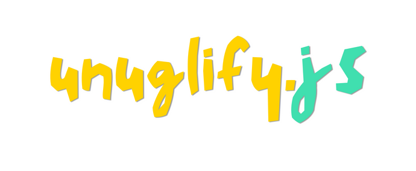

<p align="center"><p>

<br>
Un-uglify your ugly CSS by removing comments, unwanted linebreaks, tabs, etc. 

### 📁 Requirements
- nodejs

### 🍭 How to use?
```bash
git clone https://github.com/rohitaryal/CSSort.git
cd CSSort
node unuglify.js samples/sample1.css out.css
cat out.css
```
---
### 😕 What does it do?

Takes this CSS
```css
body {
    background-color: #ff00ff; /* Bright magenta background */
    color: #00ff00; /* Neon green text color */
    font-size: 2em; /* Large font size */
    text-align: center; /* Centered text */
    line-height: 3em; /* Very large line height */
    margin: 50px; /* Large margin */
    padding: 50px; /* Large padding */
    border: 10px dashed #0000ff; /* Thick dashed blue border */
}
```

And makes this
```css
body {
    margin: 50px;
    padding: 50px;
    color: #00ff00;
    font-size: 2em;
    line-height: 3em;
    text-align: center;
    background-color: #ff00ff;
    border: 10px dashed #0000ff;
}
```
---

🎅 More bugs to fix and a lot to do.